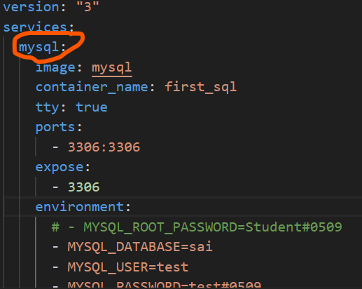

# django_restApi_project1

getting data from admin console to webPage

This project to store the information about instruments, things, products and etc

all the data stored in Database. 

the product getting stored with name, brand, type or purpose, description about Product and Rating.

**Django Create Project**

**Pre-requisities:-**

install below Packages in your PC.

```
pip install django

pip install djangorestframework

```

**Commands:-**

Clone  this Django Project using below commands

```Shell
git clone https://github.com/Saikrishnareddy12345/django_restApi_project1.git

cd django_restApi_project1/

```
Modify the settings.py file, update the database configuration.

file path is  **rest_project1/settings.py**

**Put it here HOST is localhost,if you are hosting this application on top of Any OS or Virtual Machine or your Local Laptop**

```shell

DATABASES = {
    'default': {
        'ENGINE': 'django.db.backends.mysql',
        'NAME': 'db_name',
        'USER':'user_nam',
        'PASSWORD':'password',
        'HOST':'localhost',  
        'PORT':'3306',
    
    }
}

```

**Put it here HOST is mysql, if you are hosting this application on top docker-compose must do this configuration**

```shell

DATABASES = {
    'default': {
        'ENGINE': 'django.db.backends.mysql',
        'NAME': 'db_name',
        'USER':'user_nam',
        'PASSWORD':'password',
        'HOST':'mysql',  ###this name should be match with the service name of mysql service on docker-compose.yml file which is showed in below picture.
        'PORT':'3306',
    
    }
}

```



Ensure that the above configuration is correctly entered and save the file.

Now its time to migrate the application tables and needs to create table headers by using the migration.

and ensure that you must be in the place of the manage.py file location and run the following commands below.

**Commands:-**

```shell

python manage.py makemigrations

```

OR

```shell

py manage.py makemigrations

```

the list of migrations will be shown after you entered the above command.

```

py manage.py migrate

```

The above command will do the migration and create the tables into your DB automatically

now you can run the django server

```shell

py manage.py runserver 0.0.0.0:3000

```

***Supported API's***
**Use POSTMAN tool to test this All API's, you feel real world api testing while you are doing Testing**

1) To redirect to the Home page, and it shows the API operations

```shell

http://127.0.0.1:3000/

```

2) the API shows only one Product and the output looks like in JSON format 

```shell

http://127.0.0.1:3000/detail/2

```

3) Create the product.
 
```shell

http://127.0.0.1:3000/create/

```

The creation of data must be in JSON Format. use the below syntax of format to eliminate the errors while you are creating Product.

```shell

{
    "name": "TV",
    "category": "Electronics",
    "price": "30000.0",
    "description": "watching",
    "rating": 4
    }

```

4) Update the Product by using Id.

```shell

http://127.0.0.1:3000/update/3

```

5) Delete the Product using with id.

```shell

http://127.0.0.1:3000/delete/3

```

Before doing this operation, you must run the 6 th step. it means you could know the id's and products in JSON format for which you want to delete. 

6) listout the all products in JSON format.

```
http://127.0.0.1:3000/list1/

```

***Thank You***


